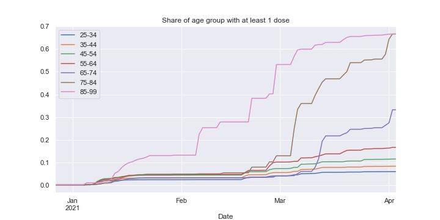
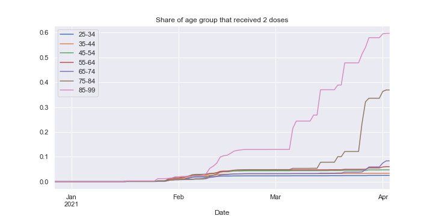
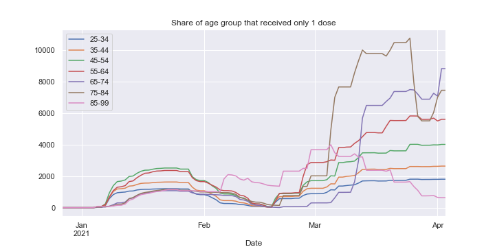

# Could we have vaccinated more efficiently? 

tl;dr: Yes. Epistemic status: Sure

- [Could we have vaccinated more efficiently?](#could-we-have-vaccinated-more-efficiently)
  - [Current state of the vaccination effort](#current-state-of-the-vaccination-effort)
    - [Vaccinations per age group](#vaccinations-per-age-group)
    - [Vaccinated per age group](#vaccinated-per-age-group)
- [Disclaimers & Notes](#disclaimers--notes)

Vorarlberg has a population of slightly below 400k and its vaccination program (just like every other in the EU) is constrained by vaccine supply.

In this post I will present the current state of the program and try to estimate how much a better strategy could have improved immunization.

## Current state of the vaccination effort

### Vaccinations per age group
Number of vaccinations per age group:

[//]: # (VaccTotal)

[//]: # (VaccTotal)

And normalized with the population per group (the target value for each age group is 2, i.e. two doses of whatever vaccine):

[//]: # (VaccRelative)

[//]: # (VaccRelative)

### Vaccinated per age group
More relevant than the number of vaccinations per age group is the number of people that received at least one shot of any of the currently available vaccines, as this seems to be sufficient as protection against severe and fatal disease.

[//]: # (D1Relative)

[//]: # (D1Relative)

[//]: # (D1Data)

|       | 1 dose Absolute | 1 dose % |
| :---- | --------------: | -------: |
| 00-24 |            1904 |     1.76 |
| 25-34 |            3091 |     5.84 |
| 35-44 |            4386 |     8.19 |
| 45-54 |            6778 |    11.32 |
| 55-64 |            8527 |    16.07 |
| 65-74 |            8979 |    25.29 |
| 75-84 |           13912 |     55.6 |
| 85-99 |            6048 |    66.16 |

[//]: # (D1Data)

And the number of people fully vaccinated (received 2 doses)

[//]: # (D2Relative)

[//]: # (D2Relative)
[//]: # (D2Data)

|       | 2 doses Absolute | 2 doses % |
| :---- | ---------------: | --------: |
| 00-24 |              665 |      0.62 |
| 25-34 |             1308 |      2.47 |
| 35-44 |             1785 |      3.33 |
| 45-54 |             2815 |       4.7 |
| 55-64 |             2921 |       5.5 |
| 65-74 |             2089 |      5.88 |
| 75-84 |             8397 |     33.56 |
| 85-99 |             5298 |     57.95 |

[//]: # (D2Data)

And as a preparation for a point that will be made later, the number of people that received only (!) one dose. 
This one is not strictly increasing as people might get a second shot at some point.

[//]: # (D1Only)

[//]: # (D1Only)

[//]: # (D1OnlyData)

|       | Only 1 dose Absolute | Only 1 dose % |
| :---- | -------------------: | ------------: |
| 00-24 |                  665 |          0.62 |
| 25-34 |                 1308 |          2.47 |
| 35-44 |                 1785 |          3.33 |
| 45-54 |                 2815 |           4.7 |
| 55-64 |                 2921 |           5.5 |
| 65-74 |                 2089 |          5.88 |
| 75-84 |                 8397 |         33.56 |
| 85-99 |                 5298 |         57.95 |

[//]: # (D1OnlyData)

# Disclaimers & Notes

- Currently, I don't take differences between the various vaccines into account. There are multiple reasons for this:
  - I am mostly interested in the impact on deaths/severe cases. All currently available vaccines are very effective in preventing those. The higher efficacy of mRNA would mostly manifest in a slower spread which is beyond the scope of this work.
  - Tracking how different age cohorts were vaccinated is pretty bothersome, due to changing rules (no AZ for old people, no AZ for young people, ...). I also think that there is no data available at this level of granularity.
- The age group `85-99` also contains all persons over 99. 