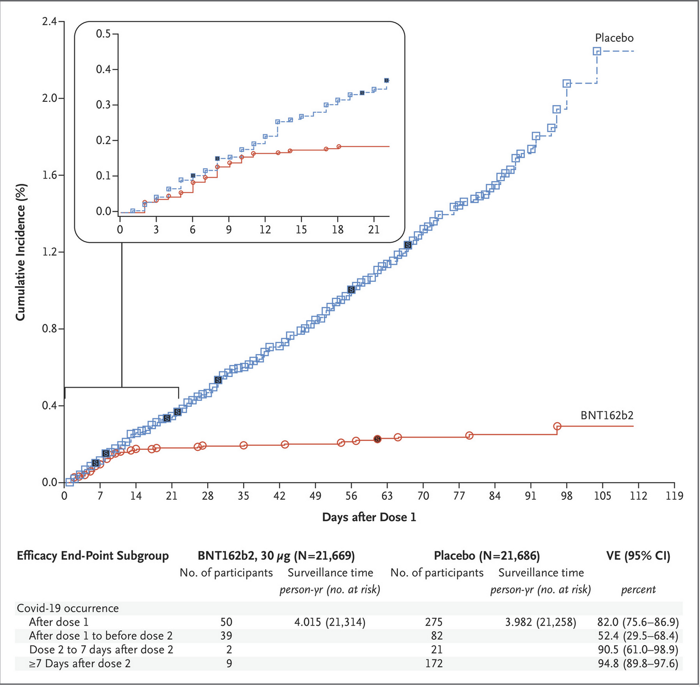
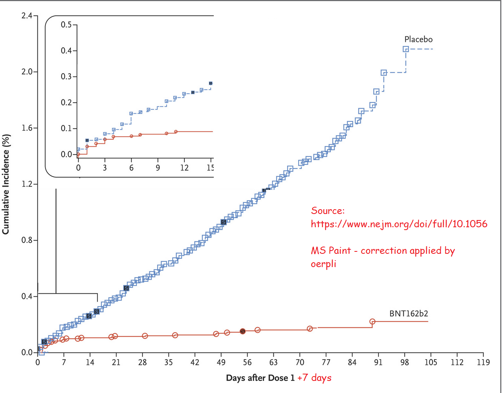

# Impact of COVID-19 vaccination strategies

Around the globe (with a few exceptions), vaccination efforts are currently constrained by supply.
My goal is not to address why there isn't a viable path to fix these supply issues (Curtis Yarvin would certainly be able to write a few dozen of pages about it if anyone asked him nicely) but how existing supply could and should be used more effectively.

## Dosing strategy

Currently, a handful of vaccinations with varying levels of efficacy are approved.
Most of them are to be administered in two doses, with several weeks in between. 

Name              | Doses | Recommended Interval
------------------|------:|-----------------------
Johnson & Johnson | 1     | -
Pfizer/Biontech   | 2     | 3 weeks
Sputnik           | 2     | 3 weeks
Novovax           | 2     | 3 weeks
Coronavac         | 2     | 3 weeks
Moderna           | 2     | 4 weeks
Astra Zeneca      | 2     | 8-12 weeks

When searching for information, why some vaccines need two doses and others do not, one can find things like:

- Weak efficacy after first dose, good efficacy after second dose [Link](https://www.healthline.com/health/why-two-doses-of-covid-vaccine#immunity-after-first-dose)
- Designed that way [Link](https://abc11.com/johnson-and-vaccine-covid-pfizer/10379441/)
- Two doses of Pfizer/Moderna are necessary [Link](https://jamanetwork.com/journals/jama/fullarticle/2776229)

When reading those and similar articles as well as their sources, the overall impression is that it's a whole lot of FUD and not much more.
To expand a bit on that a subsection of each of these points.

### Weak after first dose, strong after second
"Weak after first dose" is measured a few days after the vaccine is administered, i.e. mostly before the immune system had enough time to build up immunity.
This is measured as follows:
- N persons believe they are vaccinated at day x, half of them are given only a placebo. 
- Number of people that tested COVID positive after up to 14 days is 50% lower in vaccine group than the placebo group

As the incubation period of COVID is approximately one week, people that develop symptoms in the first week were likely already infected when they were given the vaccine.

If the first week after the 1st dose is cropped out of the picture, one gets the following result:

As approximately 50% of the cases that contribute to the 52% efficacy occurred in the first week after the 1st dose, the resulting 52% severely underestimates how effective the first dose actually is.

The 90.5% (61.0-98.9) efficacy from the first week after the second dose is likely a better estimation of the actual efficacy of the first dose (because if someone is infected 20 days after the first dose, the positive test would fall in this time interval).

### Designed that way

There were several goals & constraints when developing vaccinations for COVID:
- Get above some threshold for efficacy. I vaguely remember that back in the summer of 2020 around 60% would have been enough.
- Trials should be done as fast as possible.
- All red tape put up in dozens of years by regulations has to be respected.

