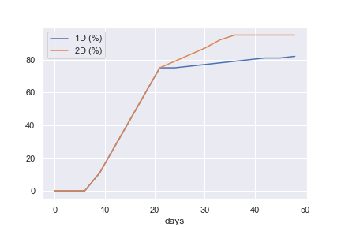

# Analysis

- [Analysis](#analysis)
  - [Some notes](#some-notes)
  - [Vacination efficacy](#vacination-efficacy)
  - [Death calculations & assumptions](#death-calculations--assumptions)
- [Results](#results)
  - [1st Approach: Only count vaccinations](#1st-approach-only-count-vaccinations)
  - [2nd Approach: Take age into account](#2nd-approach-take-age-into-account)
    - [Note regarding the estimated age distribution of COVID deaths](#note-regarding-the-estimated-age-distribution-of-covid-deaths)
    - [Note regarding simplified distribution](#note-regarding-simplified-distribution)

## Some notes
- I use smoothed death statistics to reduce data-reporting related artifacts.
- I assumed that the vaccination works the same for all age groups
- I don't consider the lag between infection and death as I have no idea what would be a suitable value there. If one would like to add a delay of `n` days, it might be enough to stretch out the first segment of the vaccine-efficacy curve, i.e. instead of 75% after 21 days, you then have 75% after n + 21 days etc. 


## Vacination efficacy
I defined some points with "reasonable" numbers for efficacy after x days and connected them with a linear fit.

[//]: # (EfficacyTable)

|   days |   1D (%) |   2D (%) |
|-------:|---------:|---------:|
|      0 |        0 |        0 |
|      3 |        0 |        0 |
|      6 |        0 |        0 |
|      9 |       11 |       11 |
|     12 |       27 |       27 |
|     15 |       43 |       43 |
|     18 |       59 |       59 |
|     21 |       75 |       75 |
|     24 |       75 |       79 |
|     27 |       76 |       83 |
|     30 |       77 |       87 |
|     33 |       78 |       92 |
|     36 |       79 |       95 |
|     39 |       80 |       95 |
|     42 |       81 |       95 |
|     45 |       81 |       95 |
|     48 |       82 |       95 |

[//]: # (EfficacyTable)

[//]: # (EfficacyFigure)



[//]: # (EfficacyFigure)

## Death calculations & assumptions

The population has size `P` (which is more or less stable) and people are infected and die from/with COVID with some rate `r` (which changes over time).
Some fraction `i` of the population is immune to COVID due to receiving a vaccination (or two of them). This results in the following formula for deaths (`D`): `D = (1 - i) * P * r`.

The population is found in demographic data (I used data from the UN and the US census).
Deaths from/with COVID are taken from [Our World In Data](https://ourworldindata.org).

When comparing various vaccination strategies, referred to as `0D`, `1D` and `2D` (zero doses, 1 dose, 2 doses), I take the very conservative assumption that this only influences the immune fraction `i` (realistically, it would also change the rate `r` that contains the number of infections).
I refer to the immunity from the different strategies as `ix`, i.e. `i1`, `i2` & `i0`

Therefore, if a country is using a two dose vaccination strategy, I estimate the number of deaths from a one dose strategy as follows:
```
D2          = (1-i2) * P * r
D2 / (1-i2) = P * r                             (1)
```
and also:
```
D1          = (1-i1) * P * r 
D1 / (1-i1) = P * r                             (2)
```
Combining (1) and (2) results in
```
D1 / (1-i1) = P * r = D2 / (1-i2)
D1                  = D2 / (1-i2) * (1-i1)      (3)
```
The same approach is used to estimate D0.

# Results

## 1st Approach: Only count vaccinations
My initial approach was to just do the following:
- Estimate the daily level of immunization resulting from both, a 1D and 2D vaccination program
- Also estimate 0D
- Estimate resulting deaths from either of them


[//]: # (SimpleAnalysis)

|                |     0D |     1D |     2D |   2D vs 0D |   1D vs 0D |   1D vs 2D |
|:---------------|-------:|-------:|-------:|-----------:|-----------:|-----------:|
| Austria        |   4850 |   4807 |   4822 |         28 |         43 |         15 |
| Germany        |  54069 |  53476 |  53595 |        474 |        593 |        119 |
| Israel         |   3958 |   2763 |   3067 |        891 |       1195 |        304 |
| United Kingdom |  66152 |  62664 |  63352 |       2800 |       3488 |        688 |
| United States  | 253315 | 243226 | 245337 |       7978 |      10089 |       2111 |

[//]: # (SimpleAnalysis)

## 2nd Approach: Take age into account
Older people have vastly higher chance of dying and are also vaccinated first (in most countries).
I found data for demographic distribution from most countries as well as data about age of COVID deaths of a few countries. Demographic data often uses bracketing that is useful to estimate the amount of people currently in school and in retirement, which is not what I am interested in. 

I split the age brackets provided by the UN (0-14,15-64,65+) into sub brackets. I took the distribution from the United States for this as it seemed reasonable enough to do so.

Furthermore, I split the deaths worldwide also with the same method into deaths by age bracket.
The data for this was obtained by the CDC.
The exact procedure for this was as follows:
- Get age distribution for each country from UN
- Split brackets into sub-brackets (e.g. 15-65 into 15-24, 25-34, ...) with the same distribution as found for the United States.
- Get the death data for each of these brackets for the United States
- Scale the deaths per age bracket of each country with the relative size of the corresponding age bracket of that country compared to US. Normalize this vector
- Multiply it with the total number of deaths observed to get an estimated age-distribution of COVID deaths of each country

The remaining analysis is similar as before, with the following differences:

- Each country is split up into sub populations based on their age bracket (e.g. Austria 0-4, Austria 5-14, ... , Austria 85+)
- Vaccinations are distributed according to age (oldest people first)
- Then for each individual sub population the analysis is the same as before


### Note regarding the estimated age distribution of COVID deaths
From a few samples I took, this seemed to understate the concentration of deaths on older people.
This seems to a peculiarity, others have found as well, e.g. [The Economist writes](https://www.economist.com/graphic-detail/2020/06/24/when-covid-19-deaths-are-analysed-by-age-america-is-an-outlier) 

> American casualties tend to be younger than European ones, which has grim implications
> 
> In hard-hit rich countries, about 60% of all deaths from the disease are among people aged 80 and over. America [=US], however, is an exception. Data [...] show that the country’s death toll skews significantly younger
>
> There, people in their 80s account for less than half of all covid-19 deaths; people in their 40s, 50s and 60s, meanwhile, account for a significantly larger share of those who die. The median covid-19 sufferer in America is a 48-year-old; in Italy it is a 63-year-old.

The result from this is that for countries where older people tend to die more from COVID compared to the US, my estimates tend to underestimate the effectiveness of all vaccination strategies (as long as the vaccinees are prioritized in the right order). 

For the analysis done here this means:

- The difference between "no vaccine" and 2 doses is underestimated
- The difference between "2 doses" and 1 dose is underestimated

This is the case because results from vaccination efforts are more pronounced, if the actually-at-risk-of-dying population is smaller (because each vaccination has a larger impact on the factor `(1-i2) * (1-i1)` in formula (3) above).

### Note regarding simplified distribution

In most countries, vaccines are not distributed according to age only. Several other factors (health conditions, occupation, politics) also play a role.

From the sources I am familiar with, my method will likely overestimate the impact (on lives lost) of the vaccination strategy for the following reasons:
- Many countries have inefficient distribution mechanisms, e.g. administrative staff of hospitals or husbands of pharmacists are given a vaccine before actually at risk people (non-administrative staff of hospitals with patient contact, old people) get their shot
- Even if the distribution prioritization of some country is optimal, most of them take multiple factors into account (risk of serious illness, risk of infection, risk of further spread).
  As my model is built on the assumption that the risk of infection & spread (baked into `r`) is constant or independent of the vaccination strategy, it awards no points for things such as "reduced spread".